# Производительность itranscribe-worker

Для просмотра с графиками откройте [`performance.html`](performance.html) локально (GitHub HTML не рендерит). Ниже тот же отчёт таблицами.

2 сентября 2026, один файл ~84 мин (`audio_duration_sec` = 5013), 10 последовательных прогонов на комбинацию, `WORKERS=1`. Три GPU: GeForce RTX 5060 Ti, GeForce RTX 4080 SUPER, RTX PRO 6000 Blackwell Server Edition. Исходники — `performance_log_*.csv` в этом каталоге.

| | |
| --- | --- |
| Самый быстрый job | **9.3 с** — gigaam без диаризации, PRO 6000 (1049× realtime) |
| Самый медленный | **343.9 с** — whisper + pyannote, 5060 Ti (14.8× realtime) |
| GigaAM vs Whisper ASR | **8×** на 5060 Ti |
| PyAnnote vs NeMo, diar | **24×** на GeForce, **18×** на PRO 6000 |
| PRO 6000 vs 5060 Ti | **1.7×** быстрее на gigaam + nemo (total) |
| Надбавка PyAnnote / NeMo к whisper-only, 5060 Ti | **+245.5 с** / **+10.1 с** |

## Модели

Цифры привязаны к чекпоинтам, не к семействам API. На всех трёх GPU они совпадают.

| Роль | Семейство в запросе | Чекпоинт |
| --- | --- | --- |
| ASR | `whisper` | `large-v3-turbo` |
| ASR | `gigaam` | `multilingual_large_ctc` |
| Диаризация | `nemo` | `nvidia/diar_streaming_sortformer_4spk-v2` (максимум 4 спикера) |
| Диаризация | `pyannote` | `pyannote/speaker-diarization-3.1` |
| Без диаризации | поле пустое | — |

`rtf` в логе = (asr + diar) / duration, без ffmpeg и alignment. «Прочее» (total − asr − diar − align) разное по хостам (RTX 5060 Ti 5.8 с, RTX 4080 SUPER 6.7 с, RTX PRO 6000 4.6 с) — это не видеокарта.

## Как выбирать (только время)

- Скорость на длинном файле — **gigaam + nemo** (16.1 с на PRO 6000, 23.0 с на 4080 SUPER, 27.9 с на 5060 Ti).
- Нужен Whisper — **whisper + nemo**, не pyannote, если карта спикеров не важнее минут.
- Нужна карта PyAnnote или больше 4 спикеров — закладывайте ~2–4 мин диаризации на этот файл; GigaAM её почти не сокращает. PRO 6000 режет PyAnnote примерно вдвое против 5060 Ti; 4080 SUPER против 5060 Ti на PyAnnote даёт мало.
- Спикеры не нужны — ASR-only.

## RTX 5060 Ti — шесть комбинаций

| Комбинация | n | ASR, с | Диар., с | Всего, с | RTF | × realtime | Надбавка к ASR-only |
| --- | ---: | ---: | ---: | ---: | ---: | ---: | ---: |
| whisper, без диаризации | 10 | 92.6 | 0.0 | 98.5 | 0.0185 | 54× | — |
| whisper + nemo | 10 | 92.6 | 10.0 | 108.6 | 0.0205 | 49× | +10.1 |
| whisper + pyannote | 10 | 93.7 | 243.4 | 343.9 | 0.0674 | 14.8× | +245.5 |
| gigaam, без диаризации | 10 | 11.9 | 0.0 | 17.7 | 0.0024 | 422× | — |
| gigaam + nemo | 10 | 11.8 | 10.3 | 27.9 | 0.0044 | 227× | +10.2 |
| gigaam + pyannote | 10 | 11.7 | 249.3 | 267.0 | 0.0521 | 19.2× | +249.3 |

Медиана по 10 последовательным прогонам. Надбавка — разница median(total) с той же ASR без диаризации.

## RTX 4080 SUPER — шесть комбинаций

| Комбинация | n | ASR, с | Диар., с | Всего, с | RTF | × realtime | Надбавка к ASR-only |
| --- | ---: | ---: | ---: | ---: | ---: | ---: | ---: |
| whisper, без диаризации | 10 | 65.0 | 0.0 | 71.7 | 0.0130 | 77× | — |
| whisper + nemo | 10 | 62.1 | 9.1 | 79.7 | 0.0145 | 69× | +8.1 |
| whisper + pyannote | 10 | 72.6 | 215.0 | 294.9 | 0.0575 | 17.4× | +223.2 |
| gigaam, без диаризации | 10 | 7.0 | 0.0 | 13.7 | 0.0014 | 714× | — |
| gigaam + nemo | 10 | 7.0 | 9.1 | 23.0 | 0.0032 | 310× | +9.2 |
| gigaam + pyannote | 10 | 7.0 | 214.7 | 228.6 | 0.0442 | 23× | +214.9 |

Медиана по 10 последовательным прогонам. Надбавка — разница median(total) с той же ASR без диаризации.

## RTX PRO 6000 — шесть комбинаций

| Комбинация | n | ASR, с | Диар., с | Всего, с | RTF | × realtime | Надбавка к ASR-only |
| --- | ---: | ---: | ---: | ---: | ---: | ---: | ---: |
| whisper, без диаризации | 10 | 45.9 | 0.0 | 50.4 | 0.0092 | 109× | — |
| whisper + nemo | 10 | 48.8 | 6.7 | 60.0 | 0.0111 | 90× | +9.5 |
| whisper + pyannote | 10 | 47.6 | 120.5 | 172.7 | 0.0335 | 30× | +122.3 |
| gigaam, без диаризации | 10 | 4.8 | 0.0 | 9.3 | 0.0010 | 1049× | — |
| gigaam + nemo | 10 | 4.8 | 6.7 | 16.1 | 0.0023 | 437× | +6.7 |
| gigaam + pyannote | 10 | 4.8 | 121.2 | 130.6 | 0.0251 | 40× | +121.3 |

Медиана по 10 последовательным прогонам. Надбавка — разница median(total) с той же ASR без диаризации.

## Три GPU × те же комбинации

Медиана total и RTF. Норма — время карты / время 5060 Ti (< 1 = быстрее). Порядок карт нигде не переворачивается: PRO 6000, затем 4080 SUPER, затем 5060 Ti. Зазор 4080 vs 5060 на PyAnnote почти съедается.

### median total, с

| Комбинация | RTX 5060 Ti | RTX 4080 SUPER | RTX PRO 6000 |
| --- | ---: | ---: | ---: |
| whisper, без диаризации | 98.5 | 71.7 | 50.4 |
| whisper + nemo | 108.6 | 79.7 | 60.0 |
| whisper + pyannote | 343.9 | 294.9 | 172.7 |
| gigaam, без диаризации | 17.7 | 13.7 | 9.3 |
| gigaam + nemo | 27.9 | 23.0 | 16.1 |
| gigaam + pyannote | 267.0 | 228.6 | 130.6 |

### median RTF

| Комбинация | RTX 5060 Ti | RTX 4080 SUPER | RTX PRO 6000 |
| --- | ---: | ---: | ---: |
| whisper, без диаризации | 0.0185 | 0.0130 | 0.0092 |
| whisper + nemo | 0.0205 | 0.0145 | 0.0111 |
| whisper + pyannote | 0.0674 | 0.0575 | 0.0335 |
| gigaam, без диаризации | 0.0024 | 0.0014 | 0.0010 |
| gigaam + nemo | 0.0044 | 0.0032 | 0.0023 |
| gigaam + pyannote | 0.0521 | 0.0442 | 0.0251 |

### Норма total к 5060 Ti

| Комбинация | RTX 5060 Ti | RTX 4080 SUPER | RTX PRO 6000 |
| --- | ---: | ---: | ---: |
| whisper, без диаризации | 1.00 | 0.73 | 0.51 |
| whisper + nemo | 1.00 | 0.73 | 0.55 |
| whisper + pyannote | 1.00 | 0.86 | 0.50 |
| gigaam, без диаризации | 1.00 | 0.77 | 0.53 |
| gigaam + nemo | 1.00 | 0.82 | 0.58 |
| gigaam + pyannote | 1.00 | 0.86 | 0.49 |

## Кому помогает более жирная карта

ASR — прогоны без диаризации. Diar — вместе с whisper.

```mermaid
xychart-beta
    title "ASR median, с"
    x-axis ["RTX 5060 Ti", "RTX 4080 SUPER", "RTX PRO 6000"]
    y-axis "с" 0 --> 100
    bar [92.6, 65.0, 45.9]
    bar [11.9, 7.0, 4.8]
```

Серии: Whisper `large-v3-turbo`, затем GigaAM `multilingual_large_ctc`.

```mermaid
xychart-beta
    title "Диаризация median, с (с whisper)"
    x-axis ["RTX 5060 Ti", "RTX 4080 SUPER", "RTX PRO 6000"]
    y-axis "с" 0 --> 260
    bar [10.0, 9.1, 6.7]
    bar [243.4, 215.0, 120.5]
```

Серии: NeMo Sortformer, затем PyAnnote 3.1.

GigaAM масштабируется по GPU сильнее Whisper. NeMo на PRO 6000 ~1.5× быстрее, чем на 5060 Ti; PyAnnote на PRO 6000 ~2×. 4080 SUPER почти не двигает PyAnnote относительно 5060 Ti.

## Кто ест время

| GPU | Комбинация | ASR | Диар. | Align, с | Прочее | Всего, с |
| --- | --- | ---: | ---: | ---: | ---: | ---: |
| RTX 5060 Ti | whisper, без диаризации | 92.6 (94%) | 0.0 (0%) | 0.00 | 5.8 (6%) | 98.5 |
| RTX 5060 Ti | whisper + nemo | 92.6 (85%) | 10.0 (9%) | 0.10 | 5.8 (5%) | 108.6 |
| RTX 5060 Ti | whisper + pyannote | 93.7 (27%) | 243.4 (71%) | 0.12 | 5.8 (2%) | 343.9 |
| RTX 5060 Ti | gigaam, без диаризации | 11.9 (67%) | 0.0 (0%) | 0.00 | 5.8 (33%) | 17.7 |
| RTX 5060 Ti | gigaam + nemo | 11.8 (42%) | 10.3 (37%) | 0.10 | 5.8 (21%) | 27.9 |
| RTX 5060 Ti | gigaam + pyannote | 11.7 (4%) | 249.3 (93%) | 0.12 | 5.8 (2%) | 267.0 |
| RTX 4080 SUPER | whisper, без диаризации | 65.0 (91%) | 0.0 (0%) | 0.00 | 6.7 (9%) | 71.7 |
| RTX 4080 SUPER | whisper + nemo | 62.1 (78%) | 9.1 (11%) | 0.10 | 6.8 (8%) | 79.7 |
| RTX 4080 SUPER | whisper + pyannote | 72.6 (25%) | 215.0 (73%) | 0.13 | 6.7 (2%) | 294.9 |
| RTX 4080 SUPER | gigaam, без диаризации | 7.0 (51%) | 0.0 (0%) | 0.00 | 6.7 (49%) | 13.7 |
| RTX 4080 SUPER | gigaam + nemo | 7.0 (31%) | 9.1 (40%) | 0.11 | 6.6 (29%) | 23.0 |
| RTX 4080 SUPER | gigaam + pyannote | 7.0 (3%) | 214.7 (94%) | 0.13 | 6.7 (3%) | 228.6 |
| RTX PRO 6000 | whisper, без диаризации | 45.9 (91%) | 0.0 (0%) | 0.00 | 4.6 (9%) | 50.4 |
| RTX PRO 6000 | whisper + nemo | 48.8 (81%) | 6.7 (11%) | 0.07 | 4.5 (8%) | 60.0 |
| RTX PRO 6000 | whisper + pyannote | 47.6 (28%) | 120.5 (70%) | 0.08 | 4.5 (3%) | 172.7 |
| RTX PRO 6000 | gigaam, без диаризации | 4.8 (51%) | 0.0 (0%) | 0.00 | 4.5 (49%) | 9.3 |
| RTX PRO 6000 | gigaam + nemo | 4.8 (30%) | 6.7 (42%) | 0.07 | 4.5 (28%) | 16.1 |
| RTX PRO 6000 | gigaam + pyannote | 4.8 (4%) | 121.2 (93%) | 0.08 | 4.5 (3%) | 130.6 |

Alignment доли секунды. «Прочее» почти константа на хосте (скорее ffmpeg с m4a) и на GigaAM без диаризации занимает треть wall-clock.

## Стабильность

| GPU | Комбинация | ASR med | ASR min–max | Диар. med | Диар. min–max | Total med | Total min–max |
| --- | --- | ---: | ---: | ---: | ---: | ---: | ---: |
| RTX 5060 Ti | whisper, без диаризации | 92.6 | 82.2–104.0 | 0.0 | 0.0–0.0 | 98.5 | 88.0–109.8 |
| RTX 5060 Ti | whisper + nemo | 92.6 | 82.1–110.3 | 10.0 | 9.9–11.5 | 108.6 | 98.0–126.1 |
| RTX 5060 Ti | whisper + pyannote | 93.7 | 81.5–105.5 | 243.4 | 241.0–245.7 | 343.9 | 329.0–354.4 |
| RTX 5060 Ti | gigaam, без диаризации | 11.9 | 11.8–11.9 | 0.0 | 0.0–0.0 | 17.7 | 17.6–17.9 |
| RTX 5060 Ti | gigaam + nemo | 11.8 | 11.7–13.1 | 10.3 | 10.2–10.3 | 27.9 | 27.7–29.2 |
| RTX 5060 Ti | gigaam + pyannote | 11.7 | 11.6–12.1 | 249.3 | 242.9–250.1 | 267.0 | 260.3–267.8 |
| RTX 4080 SUPER | whisper, без диаризации | 65.0 | 56.4–80.3 | 0.0 | 0.0–0.0 | 71.7 | 63.1–86.9 |
| RTX 4080 SUPER | whisper + nemo | 62.1 | 56.4–82.2 | 9.1 | 9.1–12.4 | 79.7 | 72.3–98.0 |
| RTX 4080 SUPER | whisper + pyannote | 72.6 | 62.8–83.8 | 215.0 | 213.0–217.2 | 294.9 | 282.8–305.0 |
| RTX 4080 SUPER | gigaam, без диаризации | 7.0 | 6.9–7.1 | 0.0 | 0.0–0.0 | 13.7 | 13.5–13.9 |
| RTX 4080 SUPER | gigaam + nemo | 7.0 | 6.9–8.9 | 9.1 | 9.1–9.4 | 23.0 | 22.8–24.9 |
| RTX 4080 SUPER | gigaam + pyannote | 7.0 | 6.9–7.1 | 214.7 | 213.0–216.4 | 228.6 | 226.8–230.3 |
| RTX PRO 6000 | whisper, без диаризации | 45.9 | 39.9–57.1 | 0.0 | 0.0–0.0 | 50.4 | 44.4–61.6 |
| RTX PRO 6000 | whisper + nemo | 48.8 | 41.8–54.5 | 6.7 | 6.7–7.9 | 60.0 | 53.1–65.7 |
| RTX PRO 6000 | whisper + pyannote | 47.6 | 39.0–57.4 | 120.5 | 119.6–121.5 | 172.7 | 164.2–181.7 |
| RTX PRO 6000 | gigaam, без диаризации | 4.8 | 4.8–4.8 | 0.0 | 0.0–0.0 | 9.3 | 9.2–9.5 |
| RTX PRO 6000 | gigaam + nemo | 4.8 | 4.7–6.1 | 6.7 | 6.7–6.7 | 16.1 | 16.0–17.2 |
| RTX PRO 6000 | gigaam + pyannote | 4.8 | 4.8–4.9 | 121.2 | 120.9–123.7 | 130.6 | 130.3–133.1 |

Whisper ASR шумный на всех картах. GigaAM и обе диаризации почти плоские. Первый прогон gigaam+nemo на каждой карте чуть медленнее остальных (warmup), в медиану входит.

## Ёмкость при WORKERS=1

Часов аудио в час ≈ 1 / median(rtf). Файлов такого размера в час ≈ 3600 / median(total).

| Комбинация | RTX 5060 Ti (аудио ч/ч / файлов/ч) | RTX 4080 SUPER (аудио ч/ч / файлов/ч) | RTX PRO 6000 (аудио ч/ч / файлов/ч) |
| --- | ---: | ---: | ---: |
| whisper, без диаризации | 54 / 36.6 | 77 / 50.2 | 109 / 71.4 |
| whisper + nemo | 49 / 33.2 | 69 / 45.2 | 90 / 60.0 |
| whisper + pyannote | 15 / 10.5 | 17 / 12.2 | 30 / 20.8 |
| gigaam, без диаризации | 422 / 203.2 | 714 / 262.5 | 1049 / 385.5 |
| gigaam + nemo | 227 / 128.8 | 310 / 156.8 | 437 / 224.0 |
| gigaam + pyannote | 19 / 13.5 | 23 / 15.7 | 40 / 27.6 |
